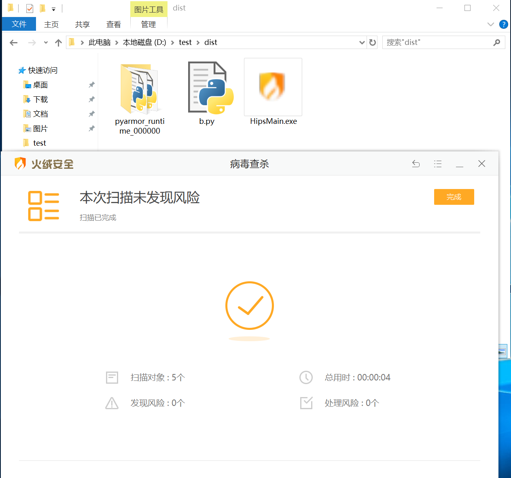
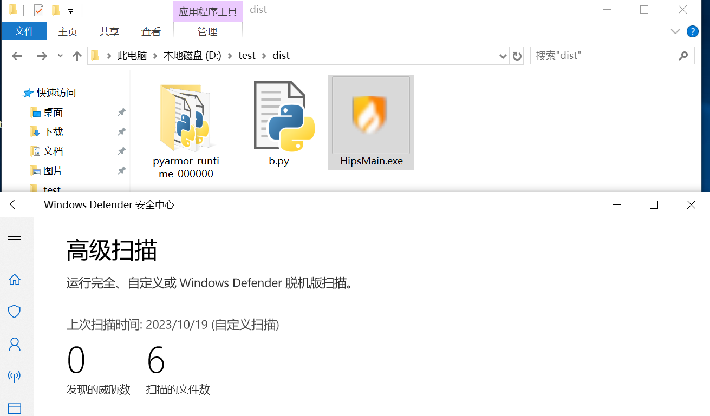
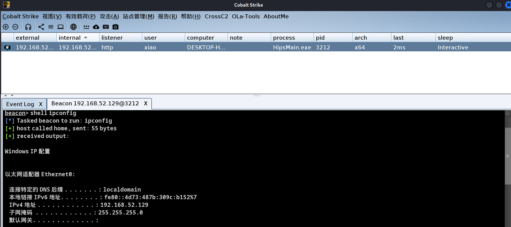

# evilhiding

shellcode loader,bypassav,免杀工具，一款基于python的shellcode免杀加载器


## 工具浅析

- 远控条件触发防沙箱
- 花指令干扰
- loader和shellcode进行fernet加密
- 触发器混淆干扰特征码
- 自动刷新ico图片的md5，防止图标特征码被查杀


## 用法

- 安装依赖

```
pip install -r requirements.txt
```

- 执行main.py

```
将shellcode填入main.py
python main.py #会生成a.txt和b.py
```

- 将a.txt放入vps，并将a.txt的url填入b.py中，再执行create.py

```
例如：url='http://192.168.52.129/a.txt'
python create.py
dist目录下生成HipsMain.exe
```

**仅支持windows系统编译!**


## 免杀测试

**过火绒**



**过defender**



**动态执行**




## 日志信息

- 2023-10-23：360、火绒 动态静态均可过，windows defender静态可过


## 声明

- 仅限用于技术研究和获得正式授权的测试活动。由于传播、利用本工具而造成的任何直接或者间接的后果及损失，均由使用者本人负责，工具作者不为此承担任何责任。
- 工具并没有多少技术含量，站在前辈肩膀上造轮子而已
- 不能免杀可以提Issues，stars是持续更新的动力，嘻嘻嘻。